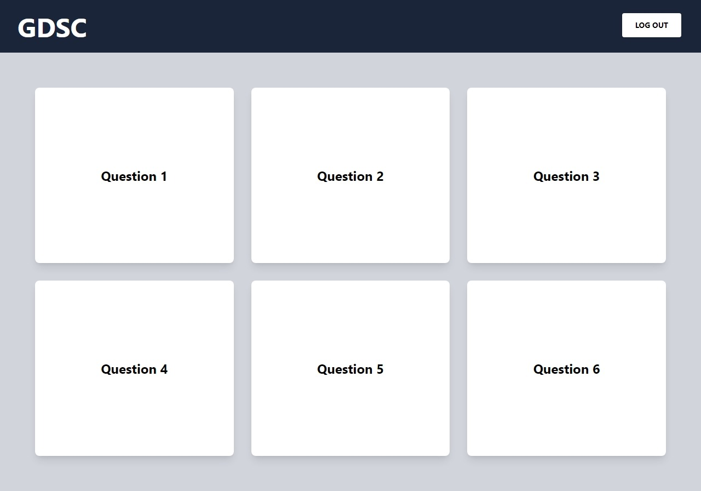
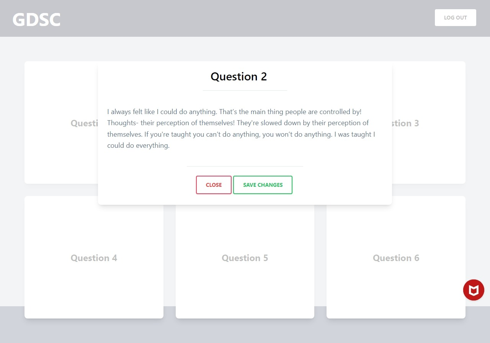

# CTF platform frontend

A simple React.js frontend project. This frontend project is created for the intent to be used in a hackathon named CTF being conducted by GDSC MRIIRS. Code is written in javascipt's React.js framework and tailwind is used for styling 

## User Interface
  

## Features and Technologies used

- Used React.js and tailwind for the development of this project

- Used React modal dependecy to encorporate an info modal

- Use grid for maintaining cards
 
## Prerequisites

Before you can use this application, ensure you have the following prerequisites:

- Node.js and npm installed 
- Git and GitHub account

## Setup

1. Clone this repository (if you haven't already):

   ```bash
   git clone https://github.com/yashsharma127/CTFPlatform.git
   cd CTFPlatform
   ```
 
## Note
 
This application is a starting point and can be expanded with additional features and improvements. Happy chatting!
 
